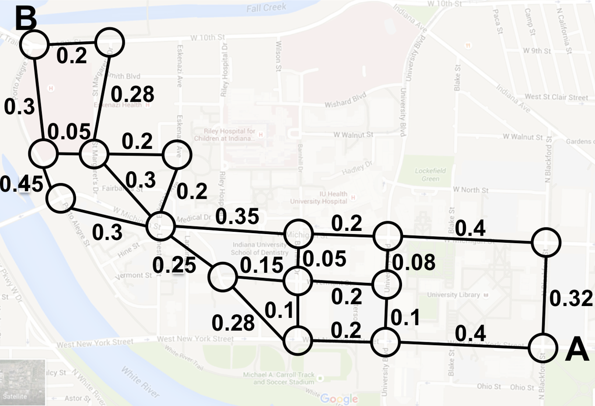

To run the program, execute the command "make run" or execute runMe. This will compile and run the program, which will return the shortest distance between points A and B on the given picture, calculated using Dijkstra's Algorithm.

